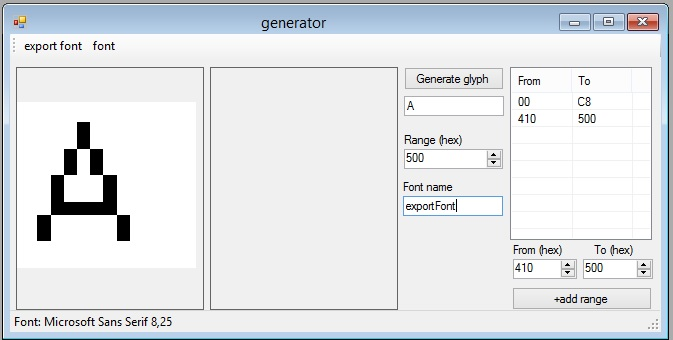

# GFXFontTool
GFX font viewer/generator for Arduino TFT


## How to use:
## 1. Generate font:
1. Open generator
2. Open font selector ('font' button) and select font
3. 'Export font' to .h file (e.g 'font1.h')

Optionally, you can specify the generation ranges ('+add range' button).

**Example for cyrillic:**
Ranges: 0x00-0xC8, 0x410-0x500



## 2. Using generated font. Arduino sketch (with TFT_eSPI):

```
#include <TFT_eSPI.h> 
#include "font1.h"; // include generated font

TFT_eSPI tft = TFT_eSPI();       
TFT_eSprite sprite = TFT_eSprite(&tft); 

// set font
tft.setFreeFont(&exportFont);  // for TFT
sprite.setFreeFont(&exportFont); // for specific sprite

// print static UTF8 string
tft.print("Test"); 
sprite.print("Test"); // for specific sprite

//print from string variable
String text="Test";
tft.print(text.c_str());
sprite.print(text.c_str());
```

## References:
* https://github.com/immortalserg/AdafruitGFXRusFonts
* https://glenviewsoftware.com/projects/products/adafonteditor/adafruit-gfx-font-format/
