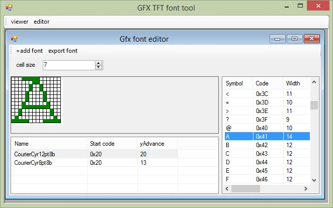

# GFXFontTool
GFX font viewer/generator for Arduino TFT

## How to use:

### Arduino sketch (with TFT_eSPI):

#include <TFT_eSPI.h> 
#include "font1.h"; // include generated font

TFT_eSPI tft = TFT_eSPI();       
TFT_eSprite sprite = TFT_eSprite(&tft); 

// set font
tft.setFreeFont(&exportFont);  // for TFT
sprite.setFreeFont(&exportFont); // for specific sprite

tft.print("Test"); // print UTF8 string
sprite.print("Test"); // for specific sprite

String text="Test";
sprite.print(text.c_str()); //print string

## References:
https://github.com/immortalserg/AdafruitGFXRusFonts
https://glenviewsoftware.com/projects/products/adafonteditor/adafruit-gfx-font-format/